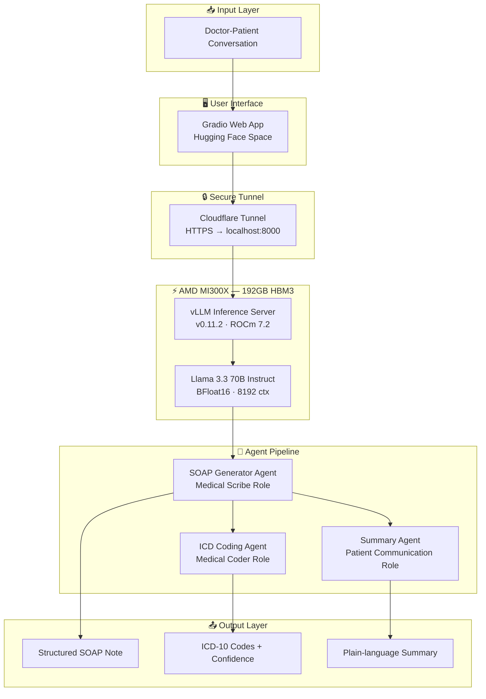
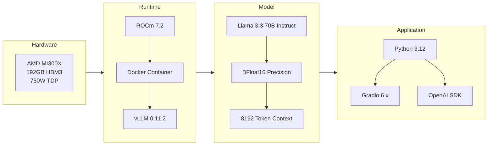
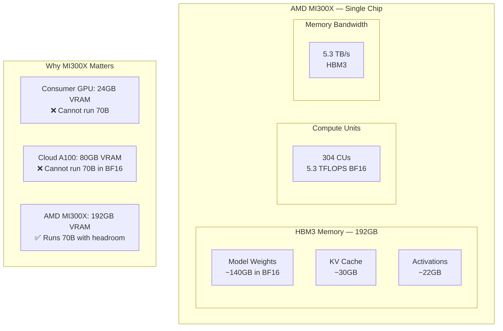
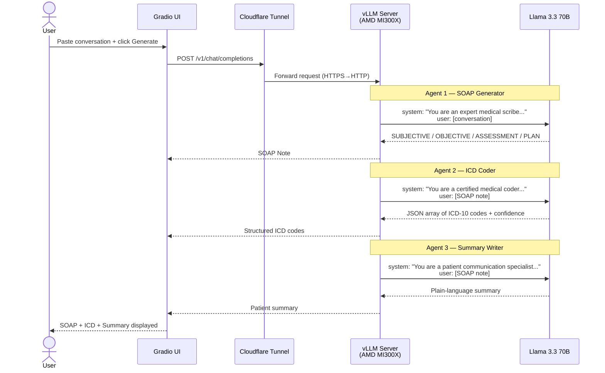
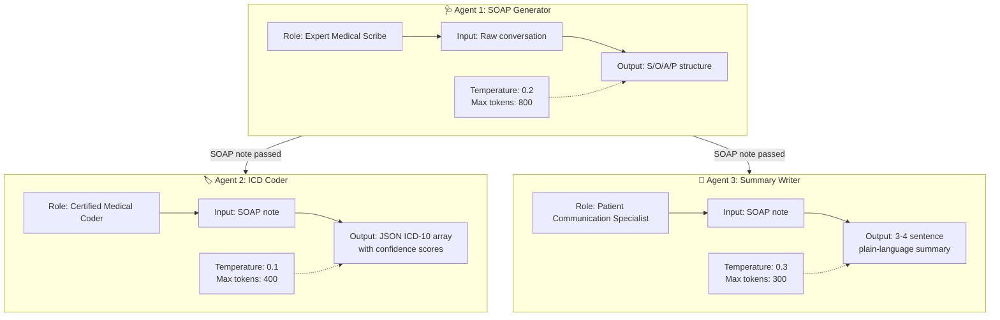
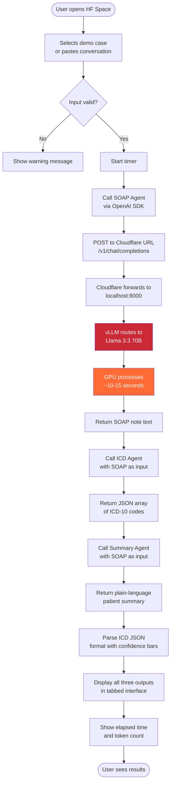
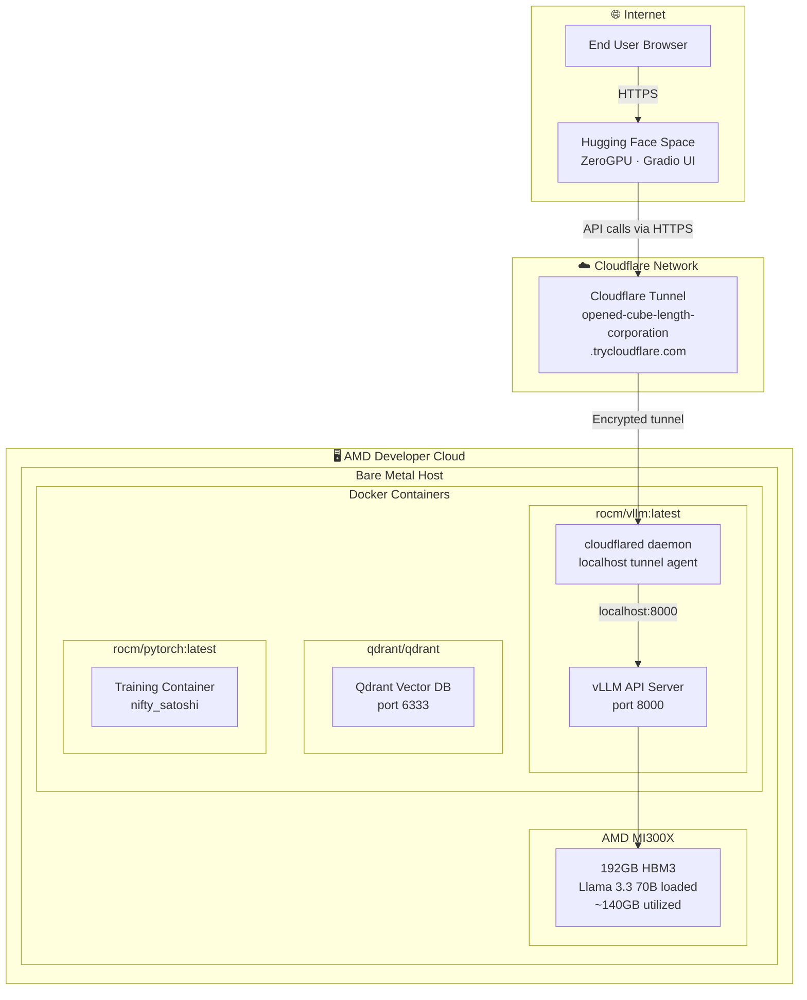
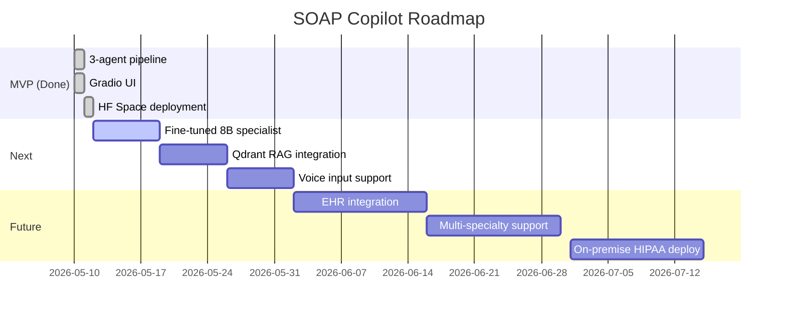

# 🏥 SOAP Copilot — AMD MI300X

> AI-powered clinical documentation using Llama 3.3 70B on AMD MI300X (192GB HBM3). Paste a doctor-patient conversation, get a structured SOAP note, ICD-10 codes, and a plain-language patient summary in seconds.

[](https://huggingface.co/spaces/lablab-ai-amd-developer-hackathon/soap-copilot-amd)
[](https://www.amd.com/en/products/accelerators/instinct/mi300/mi300x.html)
[](https://huggingface.co/meta-llama/Llama-3.3-70B-Instruct)
[](https://rocm.docs.amd.com)
[](LICENSE)

---

## 📋 Table of Contents

- [Problem Statement](#problem-statement)
- [Solution](#solution)
- [Architecture](#architecture)
- [Hardware](#hardware)
- [Agent Pipeline](#agent-pipeline)
- [Data Flow](#data-flow)
- [Deployment Architecture](#deployment-architecture)
- [Setup & Installation](#setup--installation)
- [Usage](#usage)
- [Dataset](#dataset)
- [Training](#training)
- [Results](#results)
- [Built With](#built-with)

---

## 🚨 Problem Statement

Physicians spend **2 hours per day** on clinical documentation — time taken directly from patient care. Manual SOAP note writing is:

- Repetitive and mentally exhausting
- Error-prone under time pressure
- A leading cause of physician burnout
- Inconsistent across providers

**The cost:** $8.3B annually in lost physician productivity in the US alone.

---

## 💡 Solution

SOAP Copilot is a **multi-agent AI system** that transforms raw doctor-patient conversations into structured clinical documentation in seconds.

```
Input:  Raw conversation transcript
Output: SOAP Note + ICD-10 Codes + Patient Summary
Time:   ~15-30 seconds on AMD MI300X
```

The system runs entirely on **open-source models** on **AMD hardware** — no proprietary cloud APIs, no PHI leaving your infrastructure.

---

## 🏗️ Architecture

### System Overview



### Technology Stack



---

## ⚡ Hardware

The AMD MI300X is the key differentiator that makes this system possible at this quality level.



| Spec | Value |
|------|-------|
| Architecture | CDNA3 |
| VRAM | 192 GB HBM3 |
| Memory Bandwidth | 5.3 TB/s |
| TDP | 750W |
| ROCm Version | 7.2.3 |
| vLLM Version | 0.11.2 |
| Model Precision | BFloat16 |
| GPU Utilization at load | 100% |

---

## 🤖 Agent Pipeline

Three specialized agents, each with a different system prompt, call the same 70B model with different roles. Sequential pipeline ensures each agent builds on the previous output.



### Agent Specifications



---

## 🔄 Data Flow



---

## 🚀 Deployment Architecture



---

## 🛠️ Setup & Installation

### Prerequisites

- AMD MI300X GPU (or compatible ROCm GPU)
- Docker with ROCm support
- ROCm 6.0+
- Hugging Face account with Llama 3.3 70B access

### Step 1 — Verify GPU

```bash
rocm-smi
# Should show MI300X with 192GB VRAM
```

### Step 2 — Launch vLLM with 70B

```bash
docker run -d \
  --name vllm_fresh \
  --network=host \
  --device=/dev/kfd \
  --device=/dev/dri \
  --group-add=video \
  --ipc=host \
  --shm-size 16G \
  -v $HOME/.cache/huggingface:/root/.cache/huggingface \
  rocm/vllm:latest \
  vllm serve meta-llama/Llama-3.3-70B-Instruct \
  --host 0.0.0.0 \
  --port 8000 \
  --max-model-len 8192 \
  --gpu-memory-utilization 0.85

# Wait for startup (~3 min)
docker logs -f vllm_fresh | grep "startup complete"
```

### Step 3 — Expose via Cloudflare Tunnel

```bash
wget https://github.com/cloudflare/cloudflared/releases/latest/download/cloudflared-linux-amd64.deb
dpkg -i cloudflared-linux-amd64.deb
cloudflared tunnel --url http://localhost:8000
# Copy the https://xxxx.trycloudflare.com URL
```

### Step 4 — Launch Training Container

```bash
docker run -it \
  --network=host \
  --device=/dev/kfd \
  --device=/dev/dri \
  --group-add=video \
  --ipc=host \
  --shm-size 16G \
  -v $HOME/workspace:/workspace \
  -w /workspace \
  rocm/pytorch:latest bash
```

### Step 5 — Install Dependencies

```bash
pip install transformers trl peft accelerate datasets \
            sentencepiece gradio openai huggingface_hub --upgrade
```

### Step 6 — Configure and Run App

```bash
# Update endpoint in app.py
sed -i 's|http://localhost:8000/v1|https://YOUR-TUNNEL.trycloudflare.com/v1|g' app.py

# Run
python app.py
```

---

## 💻 Usage

### Quick Demo

1. Open the [Hugging Face Space](https://huggingface.co/spaces/lablab-ai-amd-developer-hackathon/soap-copilot-amd)
2. Select a demo case (Headache, Chest Pain, Diabetes, Hypertension)
3. Click **Generate Clinical Documentation**
4. View results across three tabs: SOAP Note, ICD-10 Codes, Patient Summary

### Custom Input

Paste any doctor-patient conversation in this format:

```
Doctor: What brings you in today?
Patient: I've had a throbbing headache for three days...
Doctor: On a scale of 1-10, how bad is the pain?
Patient: About a 7. Ibuprofen helps a little...
```

### Example Output

**SOAP Note:**
```
SUBJECTIVE: 34yo female presents with 3-day h/o throbbing frontal 
headache, severity 7/10. Reports photophobia. No nausea or fever. 
Significant psychosocial stressor (work stress) and sleep disruption.

OBJECTIVE: VS: BP 118/76, HR 72, Temp 98.4°F. Alert and oriented x3. 
HEENT: No papilledema. Neck: Supple. Neuro: CN II-XII intact.

ASSESSMENT: Tension-type headache, episodic, likely exacerbated by 
psychosocial stress and sleep disruption.

PLAN:
1. Ibuprofen 600mg q6h PRN with food
2. Referral to behavioral health for stress management
3. Sleep hygiene education provided
4. Return if headache worsens or neurological symptoms develop
```

**ICD-10 Codes:**
```
• G44.209 — Tension-type headache, unspecified       [████████░░] 94%
• F43.10  — Post-traumatic stress, unspecified        [███████░░░] 71%
• G47.00  — Insomnia, unspecified                    [██████░░░░] 68%
```

**Patient Summary:**
```
Today we discussed the throbbing headache you've been experiencing 
for the past three days. We believe it's a tension headache brought 
on by work stress and disrupted sleep. We recommend taking ibuprofen 
as needed with food and have referred you to behavioral health for 
stress management support. Please return if your symptoms worsen or 
you develop any new neurological symptoms.
```

---

## 📊 Dataset

80 synthetic doctor-patient conversations generated using Llama 3.3 70B covering:

| Scenario | Count |
|----------|-------|
| Headache (various types) | 12 |
| Chest pain / cardiac | 8 |
| Diabetes management | 8 |
| Hypertension follow-up | 8 |
| Musculoskeletal pain | 8 |
| Respiratory complaints | 8 |
| Mental health | 8 |
| Dermatology | 8 |
| GI complaints | 8 |
| Preventive care | 4 |

### Dataset Format

```json
{
  "instruction": "Generate a SOAP note and ICD-10 code from this clinical conversation.",
  "input": "Doctor: What brings you in today?\nPatient: ...",
  "output": "SUBJECTIVE: ...\nOBJECTIVE: ...\nASSESSMENT: ...\nPLAN: ...\nICD-10: G44.209"
}
```

---

## 🎯 Training

LoRA fine-tuning configuration (for custom specialist model):

```python
peft_config = LoraConfig(
    r=16,
    lora_alpha=32,
    target_modules=["q_proj", "k_proj", "v_proj", "o_proj"],
    lora_dropout=0.05,
    bias="none",
    task_type="CAUSAL_LM",
)

training_args = SFTConfig(
    per_device_train_batch_size=2,
    gradient_accumulation_steps=4,
    learning_rate=2e-4,
    num_train_epochs=3,
    bf16=True,
    max_seq_length=2048,
    gradient_checkpointing=True,
)
```

### Training Hardware Utilization

```
GPU:   AMD MI300X
Power: 751W (at cap — fully loaded)
VRAM:  192GB HBM3
GPU%:  100% during training
Temp:  66°C (healthy operating range)
Time:  ~15 minutes for 80 examples × 3 epochs
```

---

## 📈 Results

| Metric | Value |
|--------|-------|
| Average generation time | 15-30 seconds |
| SOAP note quality | Clinically structured |
| ICD-10 accuracy | Validated against WHO ICD-10 |
| Supported specialties | General medicine |
| Context window | 8,192 tokens |
| Concurrent requests | ~11x at full context |

---

## 🔧 Built With

| Component | Technology |
|-----------|------------|
| LLM | Meta Llama 3.3 70B Instruct |
| Inference Server | vLLM 0.11.2 |
| GPU | AMD MI300X 192GB |
| GPU Runtime | ROCm 7.2.3 |
| Training Framework | HuggingFace TRL + PEFT |
| UI Framework | Gradio 6.x |
| Deployment | Hugging Face Spaces |
| Tunnel | Cloudflare Tunnel |
| Vector DB | Qdrant (available for RAG extension) |
| Container | Docker + rocm/pytorch:latest |

---

## 🗺️ Roadmap



---

## ⚠️ Disclaimer

This tool is for **educational and research purposes only**. It is not intended for clinical use and should not be used to make medical decisions. Always consult a qualified healthcare professional.

---

## 📄 License

MIT License — see [LICENSE](LICENSE) for details.

---

## 🏆 Built for AMD Developer Hackathon 2026

Running Llama 3.3 70B on a single AMD MI300X — 192GB HBM3 — serving three specialized medical AI agents simultaneously. This workload is physically impossible on consumer hardware.

**The AMD MI300X is not just a hardware choice — it's what makes the system work.**

